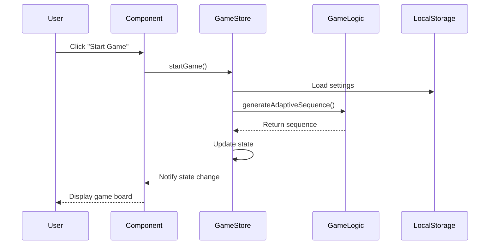
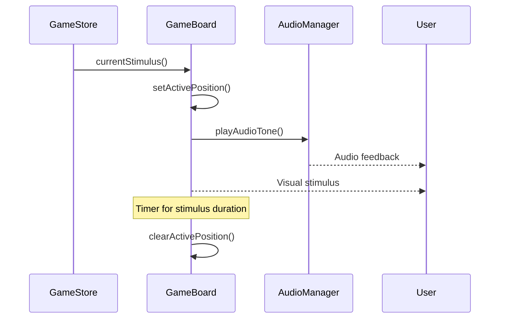
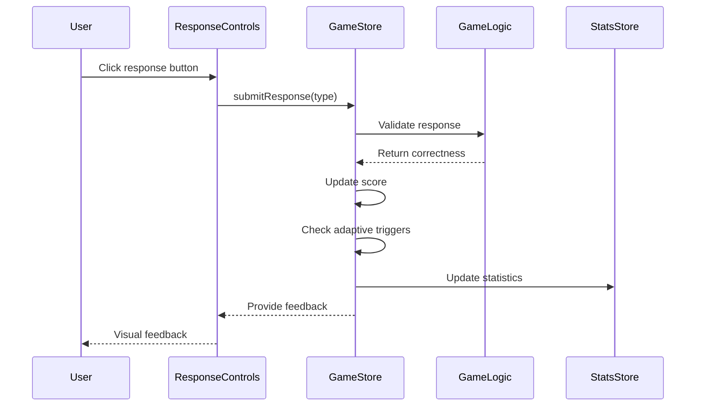
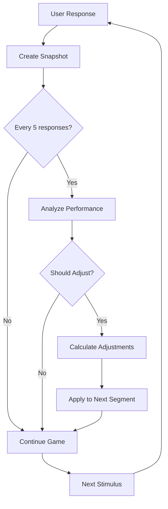
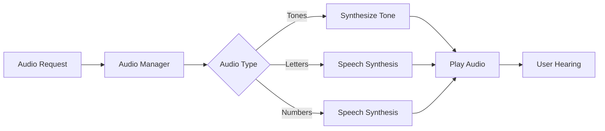
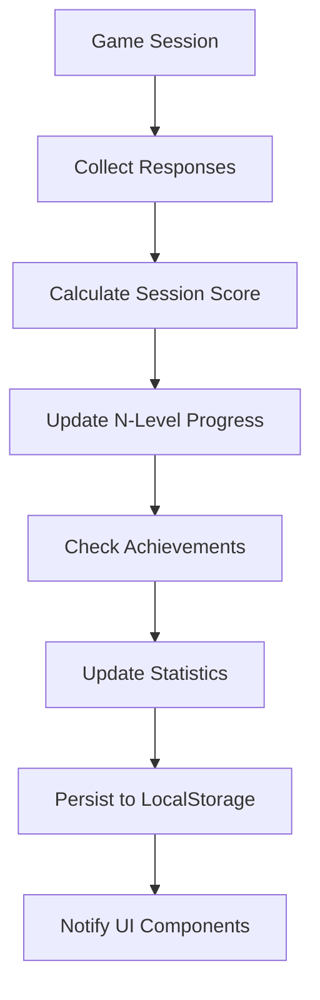
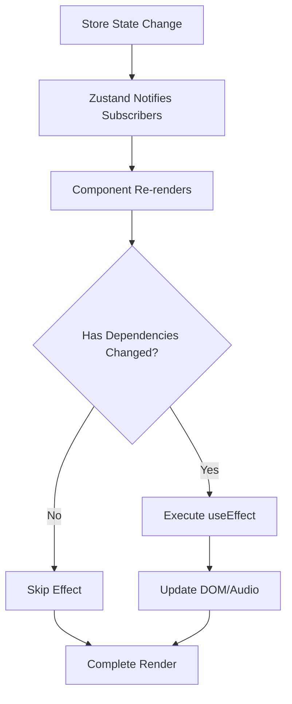
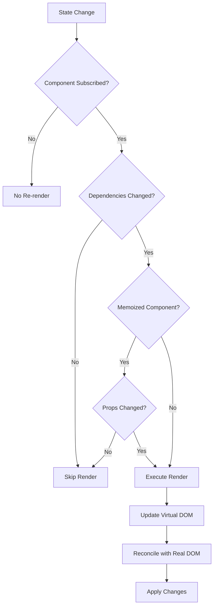
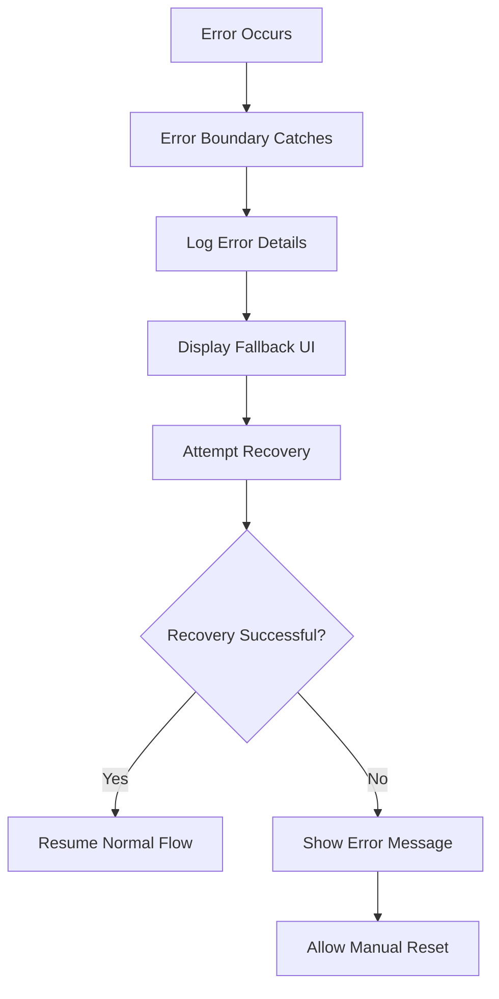

# Data Flow Architecture

This document describes how data flows through the Dual N-Back application, from user interactions to state updates and UI rendering.

## 🔄 Overview

The application follows a unidirectional data flow pattern with reactive state management, ensuring predictable and debuggable state transitions.

```
User Interaction → Component → Store Action → Business Logic → State Update → UI Re-render
       ↑                                                                           ↓
   User Feedback ←─────────────────── Audio/Visual Presentation ←─────────────────┘
```

## 🎮 Game Flow

### 1. Game Initialization



### 2. Stimulus Presentation



### 3. User Response Handling



## 📊 State Management Flow

### Store Architecture

```typescript
// State flow through Zustand stores
interface AppState {
  gameStore: GameState      // Current game session
  statsStore: Statistics    // Historical data
  settingsStore: UserPrefs  // User preferences
}
```

### State Updates

```typescript
// Example state update flow
const updateScore = (response: ResponseType) => {
  set((state) => {
    // 1. Calculate new score
    const newScore = calculateScore(state.score, response)
    
    // 2. Update performance history
    const snapshot = createPerformanceSnapshot(state.responses)
    const newHistory = [...state.performanceHistory, snapshot]
    
    // 3. Analyze adaptive triggers
    const triggers = analyzeAdaptiveTriggers(newHistory, state.nLevel)
    
    // 4. Return new state
    return {
      ...state,
      score: newScore,
      performanceHistory: newHistory.slice(-20),
      // Log adaptive insights
      ...(triggers.shouldAdjust && console.log('🧠 Adaptive AI:', triggers.reason))
    }
  })
}
```

## 🧠 Adaptive Algorithm Flow

### Performance Tracking



### Difficulty Adjustment

```typescript
// Adaptive difficulty data flow
interface AdaptiveFlow {
  input: PerformanceSnapshot[]     // Recent performance data
  analysis: AdaptiveTriggers       // Should adjust difficulty?
  adjustments: AdaptiveSettings    // How to adjust
  output: GameSequence[]           // Modified sequence
}

// Flow implementation
const adaptiveDifficultyFlow = (history: PerformanceSnapshot[]) => {
  // 1. Analyze recent performance
  const triggers = analyzeAdaptiveTriggers(history, nLevel)
  
  // 2. Calculate adjustments if needed
  if (triggers.shouldAdjust) {
    const adjustments = calculateAdaptiveAdjustments(history, nLevel)
    
    // 3. Apply to sequence generation
    const newSettings = applyAdaptiveSettings(baseSettings, adjustments)
    
    // 4. Generate updated sequence segment
    return generateAdaptiveSequence(length, gridSize, nLevel, difficulty, history)
  }
  
  return currentSequence
}
```

## 🎵 Audio System Flow

### Audio Pipeline



### Audio State Flow

```typescript
// Audio system data flow
interface AudioFlow {
  stimulus: GameSequence      // Contains audio index
  settings: AudioSettings     // Type, volume, duration
  synthesis: AudioBuffer      // Generated audio
  playback: AudioContext      // Browser audio
}

// Implementation
const audioFlow = async (stimulus: GameSequence, settings: AudioSettings) => {
  // 1. Determine audio type and parameters
  const { audioType, volume, stimulusDuration } = settings
  
  // 2. Generate or retrieve audio
  const audioBuffer = await generateAudio(stimulus.audio, audioType)
  
  // 3. Configure playback
  const audioContext = getAudioContext()
  const source = audioContext.createBufferSource()
  
  // 4. Apply settings and play
  source.buffer = audioBuffer
  source.connect(audioContext.destination)
  source.start(0, 0, stimulusDuration / 1000)
}
```

## 📈 Statistics Flow

### Data Collection



### Statistics Data Flow

```typescript
// Statistics update flow
interface StatsFlow {
  session: GameSession        // Completed game session
  calculation: SessionStats   // Computed statistics
  historical: Statistics      // Updated historical data
  achievements: Achievement[] // Unlocked achievements
}

// Implementation
const updateStatistics = (session: GameSession) => {
  // 1. Calculate session statistics
  const sessionScore = calculateGameScore(session.score)
  const sessionDuration = session.endTime - session.startTime
  
  // 2. Update historical data
  const updatedStats = {
    ...currentStats,
    totalGamesPlayed: currentStats.totalGamesPlayed + 1,
    averageScore: calculateNewAverage(currentStats.averageScore, sessionScore),
    bestScore: Math.max(currentStats.bestScore, sessionScore),
    totalPlayTime: currentStats.totalPlayTime + sessionDuration
  }
  
  // 3. Update N-level specific progress
  const nLevelStats = updateNLevelProgress(session.nLevel, sessionScore)
  
  // 4. Check for new achievements
  const newAchievements = checkAchievements(updatedStats, session)
  
  // 5. Persist and notify
  saveToLocalStorage(updatedStats)
  notifyComponents(updatedStats, newAchievements)
}
```

## 🔄 Component Update Flow

### Reactive Updates

```typescript
// Component subscription to store changes
const GameBoard: React.FC = () => {
  // 1. Subscribe to relevant state
  const { gamePhase, score, currentStimulusIndex } = useGameStore()
  
  // 2. Derived state calculations
  const accuracy = useMemo(() => 
    calculateAccuracy(score.totalCorrect, score.totalIncorrect, score.totalMissed),
    [score]
  )
  
  // 3. Effect for stimulus changes
  useEffect(() => {
    const currentStimulus = useGameStore.getState().currentStimulus()
    if (currentStimulus && gamePhase === 'stimulus') {
      // Update visual display
      setActivePosition(currentStimulus.position)
      
      // Trigger audio playback
      playAudioTone(currentStimulus.audio, settings.audioType)
    }
  }, [currentStimulusIndex, gamePhase])
  
  // 4. Render based on state
  return <GameInterface accuracy={accuracy} />
}
```

### Update Propagation



## 🎯 Performance Optimization Flow

### Optimization Strategies

1. **Memoization**: Prevent unnecessary calculations
   ```typescript
   const expensiveCalculation = useMemo(() => 
     analyzePerformanceData(responses), [responses]
   )
   ```

2. **Selective Subscriptions**: Only subscribe to needed state
   ```typescript
   const score = useGameStore(state => state.score)
   // Instead of subscribing to entire state
   ```

3. **Callback Optimization**: Prevent recreation
   ```typescript
   const handleResponse = useCallback((type: ResponseType) => {
     submitResponse(type)
   }, [submitResponse])
   ```

### Rendering Flow



## 🔍 Debugging Data Flow

### Development Tools

1. **Console Logging**: Track adaptive decisions
   ```typescript
   if (triggers.shouldAdjust) {
     console.log('🧠 Adaptive AI:', triggers.reason, triggers.urgency)
   }
   ```

2. **React DevTools**: Inspect component state and props
3. **Redux DevTools**: Monitor Zustand state changes
4. **Browser Storage**: Inspect persisted data

### Data Flow Visualization

```typescript
// Enable data flow debugging
const debugDataFlow = (action: string, data: any) => {
  if (process.env.NODE_ENV === 'development') {
    console.group(`🔍 Data Flow: ${action}`)
    console.log('Input:', data)
    console.log('Timestamp:', new Date().toISOString())
    console.trace('Call stack')
    console.groupEnd()
  }
}
```

## 🚨 Error Handling Flow

### Error Boundaries

```typescript
// Error propagation through the application
interface ErrorFlow {
  error: Error                // Original error
  boundary: ErrorBoundary     // React error boundary
  fallback: JSX.Element      // Fallback UI
  logging: ErrorReport       // Error reporting
}
```

### Error Recovery



---

This data flow architecture ensures predictable state management, optimal performance, and maintainable code while providing a rich, responsive user experience for cognitive training.
